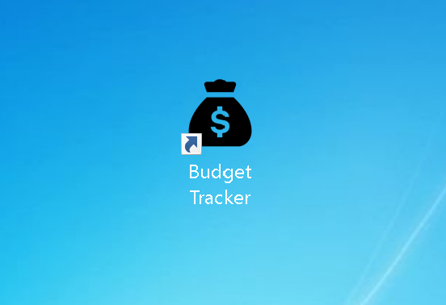

# Budget Tracker

## Table of Contents
1. [Description](#description)
2. [Installation](#installation)
3. [Usage](#usage)
4. [License](#license)
5. [Contributing](#contributing)
6. [Tests](#tests)
7. [Questions](#questions)

## Description

The Budget Tracker is a utility app for tracking funds and expenses over time.  It is a PWA (progressive web app) that has full offline functionality.  Budget Tracker uses various data storage methods to ensure that data is accounted for even when the device or server is offline.  The app is installable on any device via the browser.

Here is a screenshot of the functional app:

## Installation

To install this app navigate to [Budget Tracker App](https://budget-tracker-nystephens.herokuapp.com/) in your browser.  To install using Google Chrome follow these instructions: 

1.  On your computer, open Chrome.

2.  Go to the website you wish to install.

3.  At the top right of the address bar, click Install ➕.

4.  Follow the onscreen instructions to install the PWA.

5.  On your machine, you can find your app in chrome://apps.  A shortcut will also be installed on your desktop or home screen.  It will have the same icon that we provided in the manifest.json, shown in the following image:

To download the budget Tracker on iOs or mac using safari navigate to [Budget Tracker App](https://budget-tracker-nystephens.herokuapp.com/) in your browser and follow these instructions: 

1.  Navigate to the website you want to add as a PWA in Safari.

2.  Tap the ‘Share’ button, scroll down and tap ‘Add to Home Screen.’ 

3.  Enter the name for the app then tap add. 

4.  The PWA will show up on your home screen or desktop just like a native iOS app.

Read more at [MobileSyrup.com: How to install a Progressive Web App on your phone and computer](https://mobilesyrup.com/2020/05/24/how-install-progressive-web-app-pwa-android-ios-pc-mac/#:~:text=Navigate%20to%20the%20website%20you,like%20a%20native%20iOS%20app.)

To run the server on your local computer follow these instructions:

1.  Navigate to the GitHub repository ( https://github.com/nystephens/budget-tracker ) in your web browser and click the green dropdown menu that says “Code”.  Copy the SSH key to your clipboard and then open your terminal.  

2.  In your terminal navigate to the directory you wish to house this repository.   

3.  Type “git clone” into your command line and paste the SSH key you copied from the repository, then hit Enter.  A new file titled “budget-tracker” containing the necessary files will appear in your chosen directory.  Due to file size, Node.js and is necessary  modules will not be cloned to your repository.

4.  Since this application uses Node.js you will have to install Node and the required Node modules to operate it.  For detailed instructions on how  to install Node.js to your computer please visit: https://www.guru99.com/download-install-node-js.html  

5.  Once Node is successfully installed on your computer, navigate to the project's root directory in your terminal.  For quick access you can right click server.js in VS Code and click the option “Open in Integrated Terminal”. 

6.  Type the following command to install the proper node modules: “npm install”.  

7.  Check your newly downloaded “node_modules” folder to ensure that the correct packages have been installed.  The dependencies that are not included within the general Node module package are 

    "compression": "^1.7.4",

    "express": "^4.17.1",

    "mongoose": "^5.5.15",

    "morgan": "^1.9.1".  
    
    If any of these packages are not present within your Node modules then run the command “npm install \<node module name\>” to install them individually.  

8.  This application used MongoDB to store Json documents and data.  To download the free version of MongoDB and set up your database please click this link and follow the instructions to download MongoDB Atlas and to create a NoSql database collection: [download Mongo DB Altlas](https://docs.mongodb.com/manual/installation/). 

10.  Once you have cloned the repository, downloaded Node.js and its necessary modules, and set up your MongoDB collection you are ready to use the Budget Tracker on your local computer!  Just enter the command "npm start" in your terminal to start the server and navigate to "http://localhost:3001/" in your browser.

## Usage

To use this app first navigate to the page in your browser or open the app via your installed desktop / homescreen shortcut.  Once the app is open type a name for an addition of funds in the textarea labeled "Name of Transaction".  Then enter the amount to be deposited or withdrawn from your budget tracker in the textarea labeled "Transaction Amount".  Once the name and amount is entered press the "Add Funds" or "Subtract Funds" button to complete the transaction.  The amount will be added or subtracted in your budget tracker records and you will be able to see the total amount of funds.  The Budget Tracker also provides a helpful graph that tracks spending over time.  The X axis of the graph is time listed by day and the Y axis is a range of dollar amounts relevant to the current Budget Tracker records.  This graph will help the user visualize thier income and spending habits over time.

## License

[Apache license](http://www.apache.org/licenses/)
   Copyright [yyyy] [name of copyright owner]

      Licensed under the Apache License, Version 2.0 (the "License");
      you may not use this file except in compliance with the License.
      You may obtain a copy of the License at
   
        http://www.apache.org/licenses/LICENSE-2.0
   
      Unless required by applicable law or agreed to in writing, software
      distributed under the License is distributed on an "AS IS" BASIS,
      WITHOUT WARRANTIES OR CONDITIONS OF ANY KIND, either express or implied.
      See the License for the specific language governing permissions and
      limitations under the License.

## Contributing

To contribute please contact me via GitHub at the link provided in [Questions](#questions).  Though the app's simple core functionality works there are some extra features that could be added for a complete user experience such as: updated styling, allow for multiple users at once by creating personal data collections, and linking bank accounts so that a user can set up automatic transaction tacking.

## Tests

To test this app follow the instructions on how to download and install [Installation](#installation).  Once you have navigated to the deployed heroku app or started the serve locally you can add and subtract funds and watch to see that graphic visualizer, total, and transaction list is accurate.  Missing fields will result in a red error message saying "Missing Information".

## Questions
For questions or concerns regarding this project or future collaborations please contact the author via GitHub at:
https://github.com/nystephens
